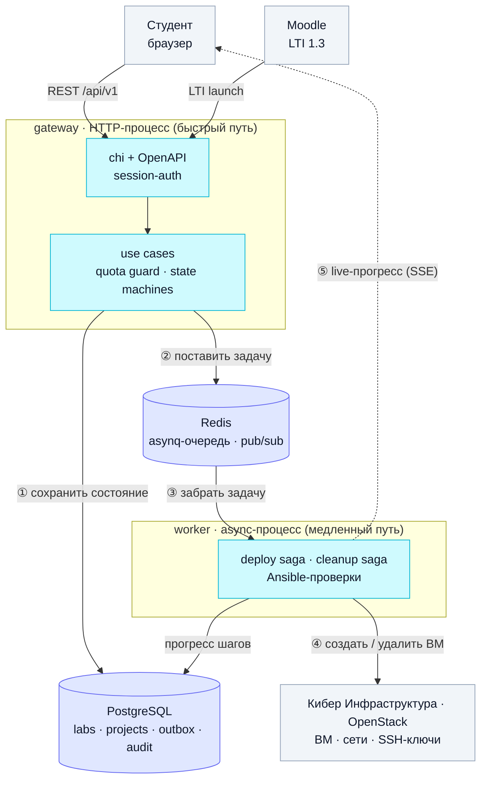

# Cloud Lab Gateway — Architecture

Безопасный шлюз оркестрации облачных лабораторных стендов на платформе «Кибер Инфраструктура» (КИ, OpenStack-совместимая) с интеграцией Moodle LMS.

## 1. Executive summary

Cloud Lab Gateway решает пять проблем учебного процесса в облаке:

1. **Безопасность.** Сервис не имеет прав суперадмина КИ — он распоряжается **заранее подготовленным пулом** изолированных проектов вместо динамического создания доменов.
2. **Защита кластера от перегрузки.** Перед каждым деплоем проверяется утилизация физических ресурсов; при >90% запуск блокируется.
3. **UX.** Сквозной сценарий из Moodle: один клик → выделенный проект → развёрнутый стенд → отчёт о проверке.
4. **Гибкий жизненный цикл.** Автоудаление по таймеру (по умолчанию 2ч), режим "заморозки" (24ч для разбора инцидентов), UI для преподавателя «на лету».
5. **Автопроверки.** Безагентный Ansible-движок для валидации конфигурации ВМ.

### Как работает бэкенд

Бэкенд — это два процесса: `gateway` (синхронный HTTP API) и `worker` (асинхронные саги). Напрямую они друг друга не вызывают — общаются через PostgreSQL (состояние) и Redis (очередь задач и шина событий). Быстрый HTTP-ответ отделён от долгого разворачивания стенда.



**По шагам:** ① `gateway` проходит quota guard и сохраняет `LabInstance` в Postgres → ② кладёт задачу деплоя в Redis и сразу отвечает студенту (HTTP 201) → ③ `worker` забирает задачу из очереди → ④ deploy saga создаёт ВМ, сети и ключи в КИ (5 идемпотентных шагов, прогресс пишется в Postgres) → ⑤ события саги через outbox и Redis уходят в SSE — браузер видит прогресс вживую.

## 2. Architectural principles

| Принцип | Что означает | Что даёт |
|---|---|---|
| **Hexagonal (Ports & Adapters)** | Домен — pure Go без infra-зависимостей. Внешний мир — за интерфейсами (`ports`). | Тестируемость без инфры; замена КИ-клиента на mock; чёткие границы для AI-агентов |
| **Modular Monolith** | Один codebase, два бинаря (`gateway` + `worker`). Бакндед-контексты — отдельные пакеты, но не сервисы. | Минимум операционной сложности на хакатоне, при этом готовность к декомпозиции |
| **Saga + Idempotency** | Длинные операции (deploy/cleanup) разбиты на идемпотентные шаги с явными компенсациями. | Recoverability после сбоев воркера, никаких "застрявших" состояний |
| **Transactional Outbox** | Доменные события и бизнес-изменения пишутся в одной транзакции; отдельный publisher рассылает события. | Невозможно потерять событие при сбое; replay для восстановления состояния |
| **State Machine — first class** | Все ресурсы имеют явные состояния и легальные переходы. Никаких "тихих" изменений. | Чёткий аудит, простые тесты, эффектная защита |
| **OpenAPI-first** | `api/openapi.yaml` — источник истины. Handlers и фронтенд-клиент генерируются из неё. | Никаких расхождений API/фронт/бэк |
| **Pessimistic locking для пула** | `SELECT ... FOR UPDATE SKIP LOCKED` для аренды проекта. | Невозможна двойная аренда при гонке |
| **Envelope Encryption** | KEK → DEK паттерн для приватных ключей и секретов. | Изоляция радиуса поражения, готовность к Vault/HSM |
| **12-factor** | Конфиг в env, логи в stdout JSON, stateless процессы. | Контейнеризация без боли, простая горизонтальная масштабируемость |

## 3. Bounded contexts

```
┌────────────────────────────────────────────────────────────────┐
│                   Cloud Lab Gateway                            │
│                                                                │
│  ┌──────────────────┐  ┌──────────────────┐                   │
│  │ Pool & Capacity  │  │  Lab Lifecycle   │                   │
│  │                  │  │                  │                   │
│  │ - Pool manager   │  │ - State machine  │                   │
│  │ - Quota guard    │  │ - Sagas          │                   │
│  │ - Project repo   │  │ - Timers/freeze  │                   │
│  └────────┬─────────┘  └────────┬─────────┘                   │
│           │                     │                              │
│  ┌────────▼─────────────────────▼─────────┐                   │
│  │            Verification                 │                   │
│  │  - Ansible runner                       │                   │
│  │  - Check templates                      │                   │
│  │  - Check results                        │                   │
│  └─────────────────────────────────────────┘                   │
│                                                                │
│  ┌──────────────────┐  ┌──────────────────┐                   │
│  │ Identity & Access│  │ LMS Integration  │                   │
│  │                  │  │                  │                   │
│  │ - Users          │  │ - LTI 1.3        │                   │
│  │ - Courses        │  │ - Moodle REST    │                   │
│  │ - RBAC policy    │  │ - Grade callback │                   │
│  └──────────────────┘  └──────────────────┘                   │
│                                                                │
│  ┌──────────────────────────────────────────┐                  │
│  │           Audit & Admin                  │                  │
│  │  - Event log (outbox)                    │                  │
│  │  - Settings                              │                  │
│  │  - Admin operations                      │                  │
│  └──────────────────────────────────────────┘                  │
└────────────────────────────────────────────────────────────────┘
```

Подробное описание каждого контекста — см. [DOMAIN_MODEL.md](DOMAIN_MODEL.md).

## 4. Layered architecture (Hexagonal)

```
┌────────────────────────────────────────────────────────────────┐
│  Inbound Adapters (driving)                                    │
│  ┌──────────┐ ┌──────────┐ ┌──────────┐ ┌──────────┐         │
│  │ REST API │ │ LTI 1.3  │ │   SSE    │ │  Admin   │         │
│  │  (chi)   │ │ Endpoint │ │  Stream  │ │   CLI    │         │
│  └────┬─────┘ └────┬─────┘ └────┬─────┘ └────┬─────┘         │
└───────┼────────────┼────────────┼────────────┼────────────────┘
        │            │            │            │
        ▼            ▼            ▼            ▼
┌────────────────────────────────────────────────────────────────┐
│  Application Layer                                             │
│  Use Cases | Sagas | Schedulers | DTOs | Authorization Policy  │
└────────────────────────┬───────────────────────────────────────┘
                         │
                         ▼
┌────────────────────────────────────────────────────────────────┐
│  Domain (pure Go, no infra deps)                               │
│                                                                │
│  Entities | Value Objects | State Machines | Domain Services   │
│  Domain Events | Aggregates                                    │
│                                                                │
│  Ports (interfaces):                                           │
│   - CloudProvider, LMSProvider, CheckRunner                    │
│   - PoolRepo, LabRepo, AuditRepo, UserRepo                     │
│   - EventBus, KeyProvider, Clock, Random                       │
└────────────────────────▲───────────────────────────────────────┘
                         │
                         │ implements
                         │
┌────────────────────────────────────────────────────────────────┐
│  Outbound Adapters (driven)                                    │
│  ┌──────────┐ ┌──────────┐ ┌──────────┐ ┌──────────┐         │
│  │OpenStack │ │  Moodle  │ │ Ansible  │ │ Postgres │         │
│  │ (gopher- │ │  REST +  │ │  Runner  │ │  pgx +   │         │
│  │  cloud)  │ │  LTI 1.3 │ │          │ │   sqlc   │         │
│  └──────────┘ └──────────┘ └──────────┘ └──────────┘         │
│  ┌──────────┐ ┌──────────┐ ┌──────────┐                       │
│  │  asynq   │ │ Secrets  │ │   SSH    │                       │
│  │  (Redis) │ │ (AES-GCM)│ │  Client  │                       │
│  └──────────┘ └──────────┘ └──────────┘                       │
└────────────────────────────────────────────────────────────────┘
```

### Слои в коде

```
internal/
├── domain/          ← pure Go, без import-ов из стандартных Go-либ кроме stdlib
│   ├── pool/        ← Project, Pool, аренда
│   ├── lab/         ← LabInstance, LabTemplate, state machine
│   ├── quota/       ← QuotaSnapshot, guard logic
│   ├── identity/    ← User, Course, Role, RBAC
│   ├── verify/      ← CheckTemplate, CheckRun, CheckStep
│   ├── audit/       ← AuditEvent, event types
│   └── shared/      ← ID types, value objects, errors
├── ports/           ← интерфейсы (driving + driven)
├── app/             ← use cases, sagas
│   ├── deploy/      ← Saga: allocate → keypair → boot → wait_ssh → check
│   ├── cleanup/     ← Saga: stop_vm → release_project → cleanup_keypair
│   ├── moodle/      ← Use cases от LMS
│   ├── student/     ← Use cases от студента
│   ├── teacher/     ← Use cases от преподавателя
│   └── admin/       ← Use cases для админа
├── adapters/
│   ├── cloud/       ← OpenStack/КИ — реализует CloudProvider
│   ├── lms/         ← Moodle REST + LTI 1.3
│   ├── checker/     ← Ansible runner
│   ├── storage/     ← pgx + sqlc реализации репозиториев
│   ├── queue/       ← asynq реализация EventBus и TaskQueue
│   ├── secrets/     ← envelope encryption
│   ├── httpapi/     ← chi handlers + middleware
│   └── sse/         ← SSE broker
└── pkg/             ← logger, errors, clock, validators
```

## 5. Key flows

### 5.1 Deploy saga (по клику в Moodle)

```
[Moodle] ──LTI launch──> [HTTP] ──> [Auth+RBAC] ──> [Lab.Create UseCase]
                                                        │
                                                        ▼
                            ┌───── [Quota guard] ─── reject if util>90%
                            │            │
                            │            ▼
                            │   [Pool.Allocate] ── reject if no FREE
                            │            │
                            │            ▼
                            │   ENQUEUE Deploy saga
                            │            │
                            │            ▼ async
                            │   ┌─────────────────────────────┐
                            │   │ STEP 1: create keypair      │ idempotent
                            │   │ STEP 2: upload SSH-key      │
                            │   │ STEP 3: boot VM             │
                            │   │ STEP 4: wait SSH (timeout)  │
                            │   │ STEP 5: initial check       │
                            │   └─────────────────────────────┘
                            │            │  on failure → compensation
                            │            │  (stop VM, release project)
                            │            ▼
                            └── lab.state = READY, emit event
                                      │
                                      ▼
                                  [SSE → UI]
```

Каждый STEP идемпотентен — при ретрае проверяет, не сделано ли уже.

### 5.2 Cleanup saga

Триггеры: таймер (2ч default), команда от пользователя, freeze-выход (24ч).

```
[Trigger] ──> mark state CLEANING
              │
              ▼
   STEP 1: stop & delete VM(s)
   STEP 2: delete keypair
   STEP 3: detach floating IPs
   STEP 4: release project (CLEANUP → FREE)
   STEP 5: emit "lab.cleaned"
```

Если STEP 1-4 падают трижды — Project уходит в `QUARANTINE` (не в `FREE`), требует ручного разбора.

### 5.3 Freeze flow

```
Student → "Сообщить о проблеме" → lab.state = FROZEN
                                  cancel cleanup timer
                                  set unfreeze_at = now + 24h
                                  notify teacher

Teacher → "Снять заморозку" → lab.state = READY, restart cleanup timer
Teacher → "Разрешить инцидент" → lab.state = CLEANING

24h истекли → auto: lab.state = CLEANING
```

### 5.4 Quota guard

```
deploy request → fetch hypervisor stats (cached 30s in Redis)
                 │
                 ▼
              estimate after = current + lab_template.resource_request
                 │
                 ▼
              if estimate.cpu_pct > 90 OR mem_pct > 90 OR disk_pct > 90:
                  emit AuditEvent{kind: "quota_blocked"}
                  return ErrQuotaExceeded
              else:
                  allow
```

Кеш утилизации обновляется фоновым тиком и сразу после успешного/неуспешного деплоя.

## 6. Tech stack

| Слой | Технология | Обоснование |
|---|---|---|
| Язык бэка | Go 1.22 | Бонусные баллы по критерию 7 за идиоматичный Go |
| HTTP router | `chi` | Минималистичен, идиоматичен, middleware stack |
| OpenStack SDK | `gophercloud` | Каноничный Go-клиент OpenStack |
| Queue | `asynq` (Redis) | Persistent, retry-with-backoff, dead-letter, UI для админа |
| DB driver | `pgx` v5 | Производительный, нативные типы Postgres |
| SQL генератор | `sqlc` | Типобезопасный SQL, нет ORM-магии |
| Migrations | `goose` | Простой, поддерживает up/down, transactional |
| Config | `viper` + env | 12-factor, разные источники |
| Logger | `zap` | JSON stdout, низкие аллокации |
| Validation | `go-playground/validator` v10 | Стандарт для REST |
| Realtime | SSE (`http.Flusher`) | Однонаправленный поток событий, без внешних либ |
| JWT | `golang-jwt/jwt` v5 | Для собственного JWT + LTI 1.3 verification |
| Crypto | `crypto/aes` + `crypto/cipher` (GCM) | Стандартная либа, AES-256-GCM envelope |
| Ansible | `exec.Command` + `ansible-playbook` | JSON callback, парсим результат |
| Frontend | React 18 + Vite + TS + Tailwind + shadcn/ui | Готовые компоненты на Radix, кастомизируем под КИ |
| Frontend state | TanStack Query + Zustand | Server state + client state |
| Frontend форм | React Hook Form + Zod | Типобезопасные формы и парсинг API |

### Что НЕ берём и почему

| Кандидат | Почему отказ |
|---|---|
| GraphQL | REST хватает; OpenAPI-first проще для тестов и фронта |
| gRPC | Не нужен между нашими процессами; усложняет браузерный клиент |
| Kubernetes | На хакатоне — docker-compose. Готовность к k8s через 12-factor |
| Vault standalone | +1 точка отказа на демо. KeyProvider-интерфейс готов к подмене |
| Kafka | Outbox + asynq покрывают; Kafka — overkill для 1 ноды |
| OpenTelemetry tracing | zap JSON-логов + audit log достаточно для защиты |
| WebSocket | Двунаправленность не нужна — команды через REST. SSE проще |
| Динамическое создание доменов в КИ | Запрещено условиями кейса (ИБ-риск) |

## 7. Cross-cutting concerns

### 7.1 Configuration

- 12-factor: всё в env. `.env.example` в репо.
- `viper` загружает env + опциональный YAML override для dev.
- Иерархия: env > `.env` > config.yaml > defaults.
- Никаких секретов в конфиге — только references.

### 7.2 Observability

- **Logging**: `zap` JSON в stdout, request_id в каждой строке, redaction для секретов (KEK, токены).
- **Audit log**: транзакционный, в БД. Источник правды для разбора инцидентов и SSE-стримов.
- **Health checks**: `/healthz` (liveness), `/readyz` (readiness — проверяет БД и Redis).
- **Metrics**: счётчики критичных операций в `audit_events` (deploys, blocks, quarantines). Prometheus — out of scope для хакатона.

### 7.3 Security

См. [SECURITY.md](SECURITY.md). Кратко:

- Envelope encryption для приватных SSH-ключей и LTI-секретов.
- JWT для собственных сессий, JWKS-валидация для LTI.
- RBAC через application-layer policy (Student/Teacher/Admin).
- Все внешние входы валидируются через Zod (фронт) и validator (бэк).
- Контейнеры от non-root, distroless, read-only rootfs где возможно.
- Линтеры: `gosec`, `gitleaks`, `hadolint`, `trivy` в CI и pre-commit.

### 7.4 Error handling

- Типизированные ошибки в `pkg/errors`: `ErrPoolEmpty`, `ErrQuotaExceeded`, `ErrCloudUnavailable`, `ErrInvalidState`, ...
- На HTTP-уровне маппинг типа ошибки → HTTP-статус + RFC 7807 problem-details.
- Wrapped errors (`fmt.Errorf("%w: ...", err)`) для traceability.
- Никаких `panic` в продакшен-коде; только `log.Fatal` в `cmd/` при критичных init-ошибках.

## 8. Operational view

### 8.1 Процессы

```
docker-compose up
├── gateway      (Go) — HTTP API + SSE + LTI endpoint        :8080
├── worker       (Go) — async задачи (deploy, cleanup, check)
├── postgres     :5432
├── redis        :6379
├── frontend     (nginx serving Vite build) или vite dev       :5173
└── nginx-proxy  (reverse proxy: / → frontend, /api → gateway) :80
```

Опционально (для демо):

```
└── moodle-emulator (Go) — мини-эмулятор Moodle для демо     :9000
```

### 8.2 Развёртывание

`docker-compose up --build` — single command. Конфиг в `.env`. Seed-скрипт для наполнения пула проектов.

См. [RUNBOOK.md](RUNBOOK.md) для пошагового запуска.

## 9. Alternatives considered (для защиты)

| Решение | Альтернатива | Почему наш выбор |
|---|---|---|
| Hexagonal | Layered (DAO/Service/Controller) | Hexagonal даёт явные интерфейсы для адаптеров → тестируемость без КИ |
| Modular monolith | Микросервисы | Микросервисы на хакатоне = смерть; модульность через пакеты сохраняет рефакторабельность |
| asynq | Celery (Python), Kafka, NATS | Persistent, idiomatic Go, UI из коробки |
| SSE | WebSocket, polling | Поток событий однонаправленный; WS overkill, polling неэффективен |
| Envelope encryption | Vault, plain AES, in-memory | Изоляция blast radius + готовность к Vault swap |
| Pessimistic locking | Optimistic + retry, advisory locks | Гонки за единственный ресурс из пула — PG-native locking надёжнее |
| Outbox | Прямая публикация событий | At-least-once при сбое publisher; not lost при сбое |
| sqlc | GORM, ent, raw SQL | Типобезопасно без ORM-сюрпризов |
| shadcn/ui | MUI, Mantine, Ant Design | Полный контроль над компонентами (код в репо), современный стек |

## 10. Roadmap по дням

См. [TASKS.md](../TASKS.md).

## 11. Открытые вопросы

- Точный формат extensions КИ поверх ванильного OpenStack — известно будет на старте.
- LTI 1.3 готовой Go-библиотеки нет; пишем JWT-handshake сами по спецификации IMS.
- Стилистика UI КИ — берём фирменные цвета из их публичных материалов; tailwind config — одна строка.
