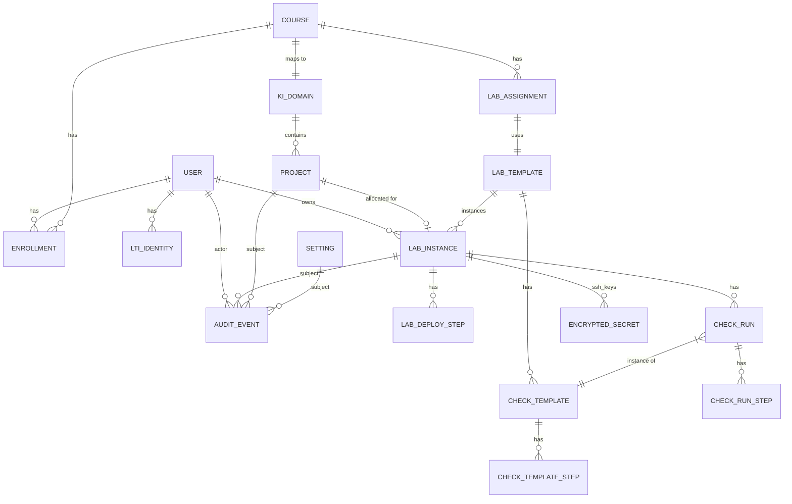

# Domain Model

Доменная модель Cloud Lab Gateway: агрегаты, сущности, value objects, инварианты, отношения.

## 1. Aggregates overview

В DDD-смысле выделены следующие aggregate roots:

| Aggregate | Root | Внутренние сущности | Транзакционная граница |
|---|---|---|---|
| **Pool** | `Project` | — | Один проект — одна транзакция аренды |
| **Lab** | `LabInstance` | `LabDeployStep`, `CheckRun` | Жизненный цикл одного стенда |
| **CheckTemplate** | `CheckTemplate` | `CheckTemplateStep` | Шаблон Ansible-проверки |
| **Course** | `Course` | `Enrollment`, `LabAssignment` | Курс из Moodle |
| **User** | `User` | `LtiIdentity` | Пользователь и его внешние identities |
| **Settings** | `Setting` | — | Глобальные настройки таймаутов |
| **Audit** | `AuditEvent` | — | Append-only лог |

## 2. ER diagram



## 3. Entities — детально

### 3.1 User

| Field | Type | Description |
|---|---|---|
| `id` | UUID | Primary key |
| `display_name` | string | Имя для UI |
| `email` | string | Из LMS, для уведомлений |
| `role` | enum: student/teacher/admin | Глобальная роль |
| `created_at` | timestamptz | |

Связанная сущность `LtiIdentity`:

| Field | Type | Description |
|---|---|---|
| `user_id` | UUID FK | |
| `lti_iss` | string | LMS issuer URL (Moodle base URL) |
| `lti_sub` | string | Subject claim из LTI (uniquely identifies user в LMS) |
| `created_at` | timestamptz | |

**Инвариант**: уникальность `(lti_iss, lti_sub)`.

### 3.2 Course

| Field | Type | Description |
|---|---|---|
| `id` | UUID | |
| `external_id` | string | course_id из Moodle |
| `name` | string | |
| `ki_domain_id` | string | ID домена в КИ (1 курс = 1 КИ domain) |
| `created_at` | timestamptz | |

**Инвариант**: один курс = один КИ-домен (по условиям кейса).

### 3.3 Enrollment

| Field | Type | Description |
|---|---|---|
| `user_id` | UUID FK | |
| `course_id` | UUID FK | |
| `role_in_course` | enum: learner/teacher | |
| `created_at` | timestamptz | |

**Инвариант**: уникальность `(user_id, course_id)`.

### 3.4 Project (Pool element)

| Field | Type | Description |
|---|---|---|
| `id` | UUID | Internal ID |
| `ki_project_id` | string | ID проекта в КИ |
| `ki_domain_id` | string FK→Course.ki_domain_id | |
| `name` | string | Для отображения админу |
| `state` | enum | FREE / ALLOCATED / CLEANING / QUARANTINE / DECOMMISSIONED |
| `allocated_to_lab_id` | UUID? FK→LabInstance | Если ALLOCATED |
| `cleanup_failures` | int | Счётчик неудачных cleanup'ов |
| `last_state_change_at` | timestamptz | |
| `created_at` | timestamptz | |

**Инварианты**:
- Если `state = ALLOCATED` → `allocated_to_lab_id` IS NOT NULL.
- Если `state ≠ ALLOCATED` → `allocated_to_lab_id` IS NULL.
- `cleanup_failures` сбрасывается в 0 при успешном переходе CLEANING → FREE.
- `cleanup_failures ≥ 3` → переход в QUARANTINE.

Реализуется через PG CHECK constraints + Go domain logic.

### 3.5 LabTemplate

Описание лабораторной работы — что разворачиваем, какие проверки выполняем.

| Field | Type | Description |
|---|---|---|
| `id` | UUID | |
| `slug` | string | Stable ID (e.g., `linux-basics-1`) для маппинга из Moodle |
| `name` | string | Display name |
| `description` | string | |
| `topology` | JSONB | См. ниже |
| `default_cleanup_after` | interval | По умолчанию 2h, override-able в Settings |
| `default_freeze_for` | interval | По умолчанию 24h |
| `default_check_template_id` | UUID? FK | Initial check после деплоя |
| `created_at` | timestamptz | |

`topology` JSON:

```json
{
  "vms": [
    {
      "name": "web",
      "image": "ubuntu-22.04",
      "flavor": "small",
      "network": "lab-net",
      "floating_ip": true,
      "user_data": "#cloud-config\n..."
    }
  ],
  "networks": [
    {"name": "lab-net", "cidr": "192.168.50.0/24"}
  ],
  "resource_request": {"vcpus": 2, "ram_mb": 4096, "disk_gb": 20}
}
```

### 3.6 LabInstance

Корневая сущность аггрегата Lab.

| Field | Type | Description |
|---|---|---|
| `id` | UUID | |
| `student_user_id` | UUID FK | |
| `course_id` | UUID FK | |
| `lab_template_id` | UUID FK | |
| `project_id` | UUID? FK | NULL до allocation |
| `state` | enum | См. STATE_MACHINES.md |
| `state_reason` | string? | Для REJECTED/FAILED |
| `ki_resources` | JSONB | `{"server_ids": ["..."], "network_id": "...", "floating_ips": ["..."], "keypair_name": "..."}` |
| `cleanup_at` | timestamptz? | Когда auto-cleanup |
| `unfreeze_at` | timestamptz? | Когда auto-unfreeze (в state FROZEN) |
| `frozen_by_user_id` | UUID? | Кто заморозил |
| `frozen_reason` | string? | |
| `student_ssh_key_secret_id` | UUID? FK→EncryptedSecret | Ключ для студента (отдельно от проверочного) |
| `checker_ssh_key_secret_id` | UUID? FK→EncryptedSecret | Ключ для проверок |
| `created_at` | timestamptz | |
| `updated_at` | timestamptz | |

**Инварианты**:
- `state = READY` → `cleanup_at` IS NOT NULL (timer установлен).
- `state = FROZEN` → `unfreeze_at` IS NOT NULL, `frozen_by_user_id` IS NOT NULL.
- `state ∈ {DEPLOYING, READY, CHECKING, FROZEN, CLEANING}` → `project_id` IS NOT NULL.
- Студент может иметь только один lab_instance в state ∉ {DONE, REJECTED, FAILED} на курс одновременно.

### 3.7 LabDeployStep

Состояние saga deploy. Recoverable.

| Field | Type | Description |
|---|---|---|
| `id` | UUID | |
| `lab_instance_id` | UUID FK | |
| `step_name` | enum | AllocateProject / CreateKeypair / ProvisionNetwork / BootVM / WaitSSH / InitialCheck |
| `status` | enum | PENDING / IN_PROGRESS / SUCCEEDED / FAILED / COMPENSATED |
| `attempt` | int | Номер попытки |
| `last_error` | string? | |
| `result` | JSONB? | Результат шага (e.g., server_id после BootVM) |
| `started_at` | timestamptz? | |
| `finished_at` | timestamptz? | |

**Инвариант**: для одного `lab_instance_id` и `step_name` ровно одна запись со `status ∈ {IN_PROGRESS, SUCCEEDED}` (или ни одной).

### 3.8 CheckTemplate

Описание Ansible-проверки.

| Field | Type | Description |
|---|---|---|
| `id` | UUID | |
| `slug` | string | |
| `name` | string | |
| `lab_template_id` | UUID? FK | NULL = глобальный шаблон |
| `playbook_path` | string | Путь к `.yml` в `ansible/checks/` |
| `timeout_seconds` | int | По умолчанию 300 |
| `expected_outcome` | JSONB | Какие task'и должны pass'нуть; schema валидации output |
| `created_at` | timestamptz | |

### 3.9 CheckRun

Выполнение конкретной проверки.

| Field | Type | Description |
|---|---|---|
| `id` | UUID | |
| `lab_instance_id` | UUID FK | |
| `check_template_id` | UUID FK | |
| `triggered_by_user_id` | UUID? | NULL = system (initial check) |
| `state` | enum | QUEUED / RUNNING / PASSED / FAILED / TIMEOUT / ERRORED |
| `started_at` | timestamptz? | |
| `finished_at` | timestamptz? | |
| `summary` | string? | Короткое описание для UI |
| `ansible_stdout` | text? | Сырой output (для drill-down) |
| `ansible_stats` | JSONB? | Parsed stats (ok/changed/failed/unreachable) |

Связанная `CheckRunStep`: per-task разбор (имя task'а, status, expected/actual).

### 3.10 EncryptedSecret

См. [SECURITY.md §2.2](SECURITY.md#22-структура-зашифрованной-записи).

### 3.11 AuditEvent

| Field | Type | Description |
|---|---|---|
| `id` | UUID | |
| `kind` | string | `lab.state_changed` / `quota_blocked` / `access_denied` / ... |
| `actor_user_id` | UUID? | NULL = system |
| `subject_type` | string | `lab_instance` / `project` / `setting` / ... |
| `subject_id` | UUID? | |
| `payload` | JSONB | Контекст события |
| `request_id` | string? | Корреляция с HTTP-запросом |
| `occurred_at` | timestamptz | |

**Инвариант**: append-only. Нет UPDATE/DELETE (даже админам — на DB-уровне через role).

### 3.12 Setting

Глобальные настройки, изменяемые админом / преподавателем через UI.

| Field | Type | Description |
|---|---|---|
| `key` | string PK | `default_cleanup_after` / `default_freeze_for` / `quota_threshold_pct` / ... |
| `value` | JSONB | |
| `scope` | enum | global / per_course / per_lab_template |
| `scope_id` | UUID? | Если scope ≠ global |
| `updated_by_user_id` | UUID | |
| `updated_at` | timestamptz | |

Иерархия применения: `lab_template > course > global`.

## 4. Value Objects

| VO | Описание |
|---|---|
| `LabState`, `ProjectState`, `CheckRunState` | enum-обёртки с методом `CanTransitionTo(next)` |
| `ResourceRequest` | `{vcpus, ram_mb, disk_gb}` с `Add`, `Subtract`, `Fits(capacity)` |
| `QuotaSnapshot` | `{vcpus_used/total, ram_used/total, disk_used/total, fetched_at}` с `Utilization()`, `Predict(req)` |
| `FloatingIP` | `{ip, allocated_to_lab_id}` |
| `SSHKeyMaterial` | Wrapped `[]byte`, всегда zeroize-able |
| `LTIIdentity` | `{iss, sub}` с `String()` для логов |

## 5. Domain services

В `internal/domain/<context>/service.go`:

| Service | Контекст | Что делает |
|---|---|---|
| `PoolAllocator` | pool | Атомарная аренда проекта из пула |
| `QuotaGuard` | quota | Проверка `current + request > threshold` |
| `LabStateMachine` | lab | Валидация переходов |
| `CleanupScheduler` | lab | Вычисляет `cleanup_at` / `unfreeze_at` |
| `CheckEvaluator` | verify | Сравнение `ansible_stats` с `expected_outcome` |
| `AccessPolicy` | identity | RBAC checks |

Сервисы — stateless, оперируют переданными entities + ports.

## 6. Domain events

В `internal/domain/audit/events.go`:

```go
type Event interface {
    Kind() string
    Subject() (string, uuid.UUID)
    Payload() any
}

// Examples:
type LabStateChanged struct { LabID uuid.UUID; From, To LabState; Reason string }
type QuotaBlocked    struct { LabID uuid.UUID; Snapshot QuotaSnapshot; Request ResourceRequest }
type ProjectAllocated struct { ProjectID, LabID uuid.UUID }
type ProjectQuarantined struct { ProjectID uuid.UUID; Reason string; Failures int }
type AccessDenied    struct { UserID uuid.UUID; Action string; Resource string }
type SecretAccessed  struct { SecretID uuid.UUID; Kind string }
```

События публикуются через `EventBus` (in-process channel + outbox для persistence).

## 7. Repository interfaces (selected)

В `internal/ports/repositories.go`:

```go
type PoolRepo interface {
    // AllocateOneFree выбирает один FREE-проект в указанном домене и переводит его
    // в ALLOCATED, используя SELECT ... FOR UPDATE SKIP LOCKED. Атомарно.
    AllocateOneFree(ctx context.Context, kiDomainID string, labID uuid.UUID) (*Project, error)
    Release(ctx context.Context, projectID uuid.UUID) error
    Quarantine(ctx context.Context, projectID uuid.UUID, reason string) error
    GetByID(ctx context.Context, id uuid.UUID) (*Project, error)
    ListByDomain(ctx context.Context, kiDomainID string) ([]Project, error)
}

type LabRepo interface {
    Create(ctx context.Context, lab *LabInstance) error
    GetByID(ctx context.Context, id uuid.UUID) (*LabInstance, error)
    UpdateState(ctx context.Context, id uuid.UUID, newState LabState, reason string) error
    FindActiveByStudentAndCourse(ctx context.Context, studentID, courseID uuid.UUID) (*LabInstance, error)
    ListPendingCleanup(ctx context.Context, before time.Time) ([]LabInstance, error)
    ListPendingUnfreeze(ctx context.Context, before time.Time) ([]LabInstance, error)
}

type AuditRepo interface {
    Append(ctx context.Context, ev AuditEvent) error
    // AppendInTx используется в outbox-паттерне.
    AppendInTx(ctx context.Context, tx Tx, ev AuditEvent) error
    Query(ctx context.Context, filter AuditFilter) ([]AuditEvent, error)
}
```

Полный набор — в `internal/ports/`.

## 8. Aggregate invariants — tabular

| Aggregate | Инвариант | Как поддерживается |
|---|---|---|
| Project | `state=ALLOCATED ⇔ allocated_to_lab_id NOT NULL` | PG CHECK constraint + Go domain logic |
| Project | Уникальность аренды | `SELECT ... FOR UPDATE SKIP LOCKED` |
| LabInstance | Один active lab per (student, course) | Unique partial index на `(student_user_id, course_id) WHERE state NOT IN ('DONE','REJECTED','FAILED')` |
| LabInstance | `state=READY ⇒ cleanup_at NOT NULL` | CHECK constraint |
| LabDeployStep | Один IN_PROGRESS step per (lab, step_name) | Unique partial index |
| AuditEvent | Append-only | DB role: GRANT INSERT only |
| Settings | Иерархия scope | Domain service `SettingsResolver` |
| EncryptedSecret | AAD соответствует kind+ref_id | AES-GCM AAD check на decrypt |

## 9. Что НЕ делаем

| Не делаем | Причина |
|---|---|
| ORM с lazy loading | sqlc — типобезопасный raw SQL, без сюрпризов |
| Сложные joins на load | Лоадим агрегаты целиком per call (мало сущностей в каждом) |
| Cross-aggregate transactions | Saga'и через outbox + retry |
| Soft deletes везде | Только для `users` и `lab_templates`. Остальное — terminal states. |
| Event sourcing | Outbox + audit log достаточно; полный ES — overkill |
