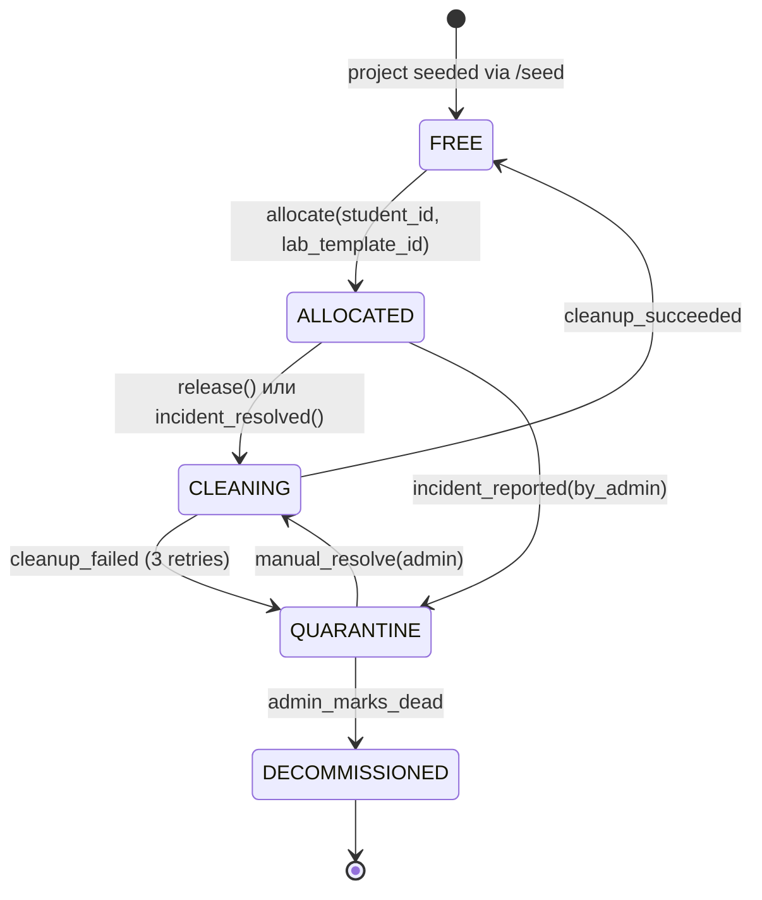
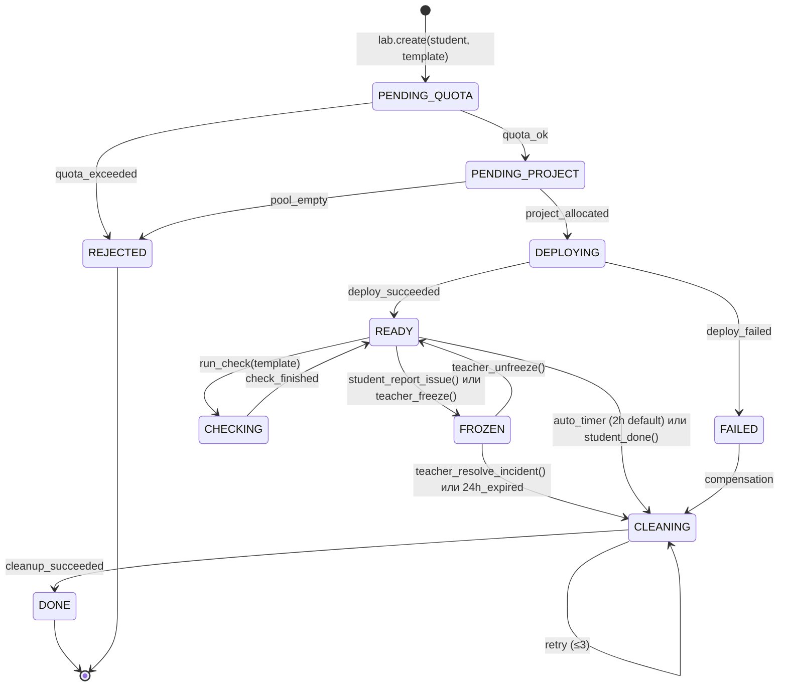
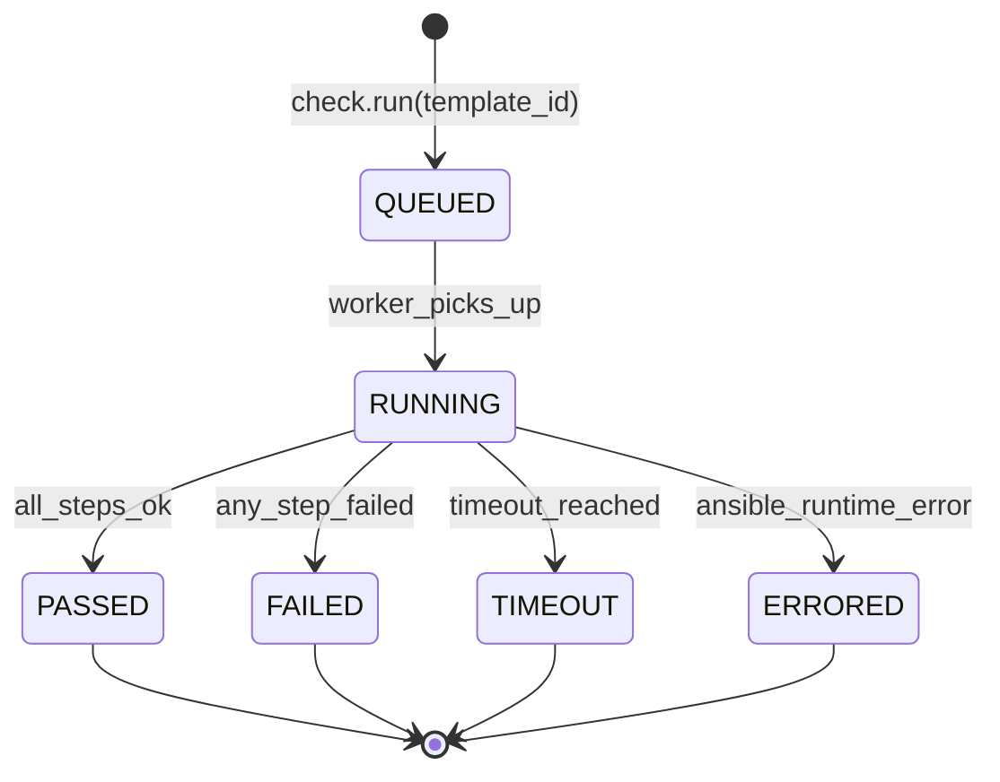
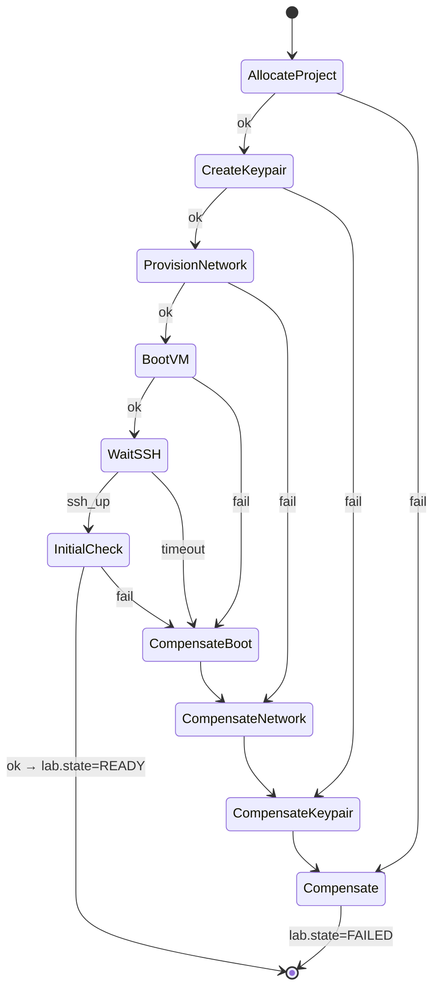
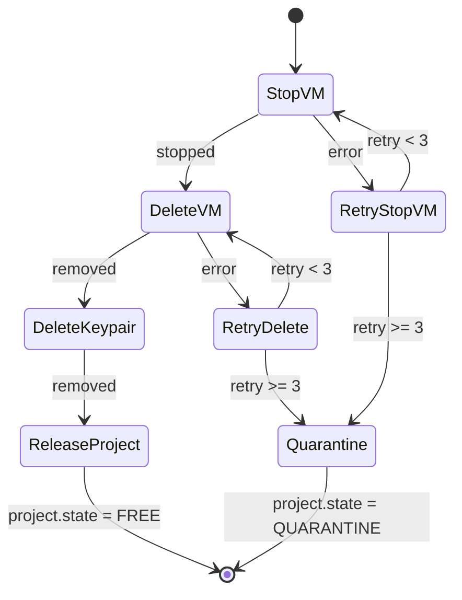

# State Machines

Все долгоживущие сущности в системе имеют явные state machines. Переходы — только через явные команды use-case'ов или таймеры; "тихих" изменений состояния не существует. Каждый переход записывает `AuditEvent` в той же транзакции, что и изменение состояния (transactional outbox).

## 1. Project (в пуле)

`Project` — заранее созданный в КИ изолированный проект (tenant). Им управляет Pool Manager.



### Инварианты
- **Уникальность аренды**: в любой момент времени `Project` либо `FREE`, либо привязан ровно к одной `LabInstance`.
- **Атомарность аренды**: переход `FREE → ALLOCATED` происходит через `SELECT ... FOR UPDATE SKIP LOCKED` в одной транзакции с созданием `LabInstance`.
- **Quarantine после ошибок**: после 3 неудачных попыток cleanup проект не возвращается в `FREE`, требует ручного разбора.

### Переходы

| From | To | Команда | Кто инициирует |
|---|---|---|---|
| FREE | ALLOCATED | `Pool.Allocate` | Deploy saga |
| ALLOCATED | CLEANING | `Pool.Release` | Cleanup saga / freeze expire |
| CLEANING | FREE | `Pool.MarkClean` | Cleanup saga success |
| CLEANING | QUARANTINE | `Pool.Quarantine` | Cleanup saga (3 retries failed) |
| ALLOCATED | QUARANTINE | `Pool.Quarantine` | Admin при инциденте |
| QUARANTINE | CLEANING | `Pool.ManualResolve` | Admin |
| QUARANTINE | DECOMMISSIONED | `Pool.Decommission` | Admin |

---

## 2. LabInstance

`LabInstance` — конкретный развёрнутый стенд студента в выделенном проекте.



### Состояния — описание

| Состояние | Что значит | Visible to student | Можно отменить? |
|---|---|---|---|
| `PENDING_QUOTA` | Запрос принят, проверяем quota | "Выделяем ресурсы…" | да (через `lab.cancel`) |
| `PENDING_PROJECT` | Quota OK, ищем свободный проект в пуле | "Выделяем ресурсы…" | да |
| `REJECTED` | Запрос отклонён (quota / pool / unauthorized) | "Отказ: <причина>" | terminal |
| `DEPLOYING` | Саг идёт; VM создаётся | "Разворачиваем стенд…" с шагами | нет (только заморозить после READY) |
| `READY` | Стенд готов, доступ открыт | "Готов. Доступ: <ssh+ip>" | да (cleanup) или freeze |
| `CHECKING` | Идёт Ansible-проверка | "Проверяем конфигурацию…" | нет |
| `FROZEN` | Заморожен (инцидент), unfreeze_at = now+24h | "Заморожено для разбора" | teacher unfreeze/resolve |
| `FAILED` | Саг провалился | "Ошибка деплоя — см. лог" | автоматически переходит в CLEANING |
| `CLEANING` | Идёт удаление ресурсов | "Очистка…" | нет |
| `DONE` | Удалено успешно | "Завершено" | terminal |

### Таймеры

| Таймер | Срабатывает в состоянии | Действие | Настраивается |
|---|---|---|---|
| `cleanup_at` | `READY` | переход в `CLEANING` | Teacher через UI |
| `unfreeze_at` | `FROZEN` | переход в `CLEANING` | Admin через UI |
| `deploy_timeout` | `DEPLOYING` | переход в `FAILED` | Admin (default 10min) |
| `check_timeout` | `CHECKING` | переход в `READY` с check_status=timeout | Per check template |

### Переходы — допустимые команды

| From | To | Команда / Триггер | Кто инициирует |
|---|---|---|---|
| ∅ | PENDING_QUOTA | `Lab.Create` | LMS / Student |
| PENDING_QUOTA | REJECTED | `quota_guard` rejected | System |
| PENDING_QUOTA | PENDING_PROJECT | `quota_guard` ok | System |
| PENDING_PROJECT | REJECTED | `pool_allocator` no free | System |
| PENDING_PROJECT | DEPLOYING | `pool_allocator` ok | System |
| DEPLOYING | READY | Deploy saga done | Worker |
| DEPLOYING | FAILED | Deploy saga error/timeout | Worker |
| READY | CHECKING | `Check.Run` | Student / Teacher |
| CHECKING | READY | Check finished | Worker |
| READY | FROZEN | `Lab.Freeze` | Student "report" / Teacher |
| FROZEN | READY | `Lab.Unfreeze` | Teacher |
| FROZEN | CLEANING | `Lab.Resolve` или `unfreeze_at` | Teacher / System |
| READY | CLEANING | `cleanup_at` / `Lab.Stop` | System / Student |
| FAILED | CLEANING | compensation | Worker |
| CLEANING | DONE | Cleanup saga done | Worker |

### Запрещённые переходы

- Прямой переход в `DONE` минуя `CLEANING` — невозможен (всегда нужно очистить ресурсы).
- `REJECTED → *` — невозможен (terminal).
- `DONE → *` — невозможен (terminal).
- `FROZEN → DEPLOYING` — нет, заморозка после деплоя.

---

## 3. CheckRun

`CheckRun` — выполнение конкретного Ansible-плейбука против развёрнутой ВМ.



| Состояние | Описание |
|---|---|
| QUEUED | В очереди, ждёт воркер |
| RUNNING | Ansible playbook выполняется |
| PASSED | Все step'ы успешны |
| FAILED | Хотя бы один step не прошёл валидацию (логический отказ) |
| TIMEOUT | Не уложились в timeout |
| ERRORED | Ошибка выполнения (нет SSH, синтаксис playbook'а, etc.) |

Каждый `CheckRun` имеет связанные `CheckStep[]` — результаты отдельных tasks из playbook'а. На UI преподавателю выводится drill-down: какой step упал, ожидаемый/фактический output.

---

## 4. Deploy Saga (детально)

Saga — не state machine сущности, а последовательность шагов с компенсацией. Сохраняется в `deploy_saga_state` для recoverability.



### Идемпотентность каждого шага

| Шаг | Идемпотентность | Compensation |
|---|---|---|
| AllocateProject | Уже выделен этому lab_instance? → return existing | Pool.Release |
| CreateKeypair | Keypair с таким именем уже существует? → reuse | Delete keypair |
| ProvisionNetwork | Network уже создана? → reuse | Delete network |
| BootVM | Server с таким name уже есть? → reuse | Delete server |
| WaitSSH | Просто polling — идемпотентен по природе | n/a |
| InitialCheck | Запись в CheckRun с deduplication по deploy_id | n/a |

Имена ресурсов в КИ: `lab-{lab_instance_id}-{resource_kind}`, что обеспечивает predictable lookup и идемпотентность.

---

## 5. Cleanup Saga



При успехе: `lab.state = DONE`, `project.state = FREE`.
При quarantine: `lab.state = DONE`, `project.state = QUARANTINE`. Lab помечается `cleanup_warning = true`.

---

## 6. Хранение состояния

| Сущность | Таблица | Поле состояния |
|---|---|---|
| Project | `projects` | `state` (enum) |
| LabInstance | `lab_instances` | `state` (enum) |
| CheckRun | `check_runs` | `state` (enum) |
| Deploy saga | `saga_state` | `step` + `last_result` JSON |

Все enum'ы — Postgres `CHECK` constraints + Go-енумы в `domain/{...}`. См. [migrations/0001_init.sql](../migrations/0001_init.sql).

## 7. Валидация переходов

В коде каждая state machine реализуется как:

```go
// internal/domain/lab/state.go (skeleton)
type State string

var allowedTransitions = map[State][]State{
    PendingQuota:    {Rejected, PendingProject},
    PendingProject:  {Rejected, Deploying},
    Deploying:       {Ready, Failed},
    Ready:           {Checking, Frozen, Cleaning},
    Checking:        {Ready},
    Frozen:          {Ready, Cleaning},
    Failed:          {Cleaning},
    Cleaning:        {Done, Cleaning}, // self-loop = retry
    // terminal: Done, Rejected — no transitions
}

func (l *LabInstance) Transition(to State, reason string, now time.Time) error {
    if !canTransition(l.State, to) {
        return ErrInvalidTransition{From: l.State, To: to}
    }
    l.State = to
    l.UpdatedAt = now
    l.recordEvent(EventStateChanged{To: to, Reason: reason})
    return nil
}
```

Любой код, меняющий `State` напрямую (без `Transition`), — bug, ловится `golangci-lint` правилом `forbidigo`.
